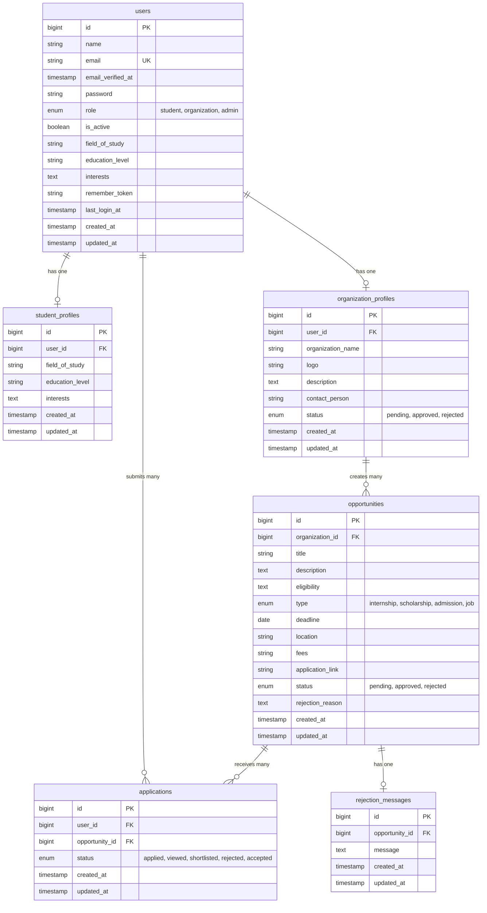

# Entity Relationship Diagram (ERD)

Copy the code below and paste it into https://mermaid.live to view the diagram:

```mermaid
erDiagram
    users ||--o| student_profiles : "has one"
    users ||--o| organization_profiles : "has one"
    users ||--o{ applications : "submits many"
    organization_profiles ||--o{ opportunities : "creates many"
    opportunities ||--o{ applications : "receives many"
    opportunities ||--o| rejection_messages : "has one"

    users {
        bigint id PK
        string name
        string email UK
        timestamp email_verified_at
        string password
        enum role "student, organization, admin"
        boolean is_active
        string field_of_study
        string education_level
        text interests
        string remember_token
        timestamp last_login_at
        timestamp created_at
        timestamp updated_at
    }

    student_profiles {
        bigint id PK
        bigint user_id FK
        string field_of_study
        string education_level
        text interests
        timestamp created_at
        timestamp updated_at
    }

    organization_profiles {
        bigint id PK
        bigint user_id FK
        string organization_name
        string logo
        text description
        string contact_person
        enum status "pending, approved, rejected"
        timestamp created_at
        timestamp updated_at
    }

    opportunities {
        bigint id PK
        bigint organization_id FK
        string title
        text description
        text eligibility
        enum type "internship, scholarship, admission, job"
        date deadline
        string location
        string fees
        string application_link
        enum status "pending, approved, rejected"
        text rejection_reason
        timestamp created_at
        timestamp updated_at
    }

    applications {
        bigint id PK
        bigint user_id FK
        bigint opportunity_id FK
        enum status "applied, viewed, shortlisted, rejected, accepted"
        timestamp created_at
        timestamp updated_at
    }

    rejection_messages {
        bigint id PK
        bigint opportunity_id FK
        text message
        timestamp created_at
        timestamp updated_at
    }
```
